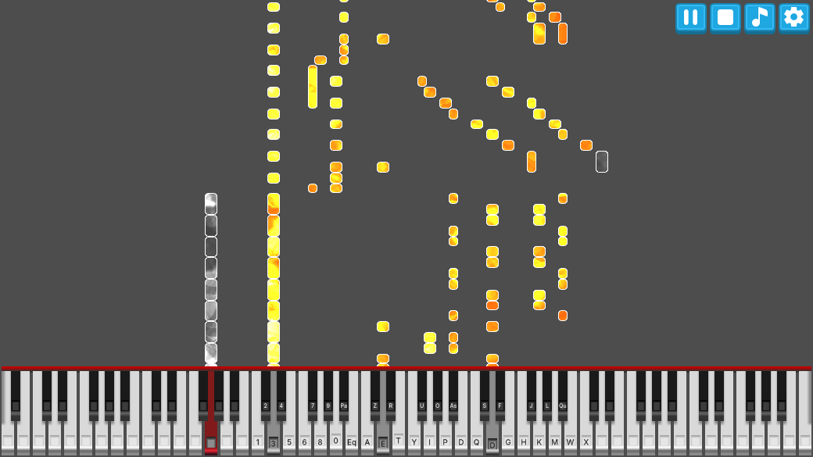

#  Bard Music Binding

A Windows Free and Open Source Software to convert MIDI input from either files or physical devices to keyboard keys events.

Although this program was made to support the [Bard Interactive Music](https://github.com/Phibonacci/Bard-Interactive-Music) mod for [Project Zomboid](https://en.wikipedia.org/wiki/Project_Zomboid), it will work for any window expecting KeyPressed and KeyRelease events.

## Feature

- Play MIDI instruments
- Play/Pause/Stop MIDI files
- Bind a keyboard key to any note
- Window picker
- Autolock a previously picked window
- Visualize notes sent

## Linux or Mac

This software is built from Godot. The MIDI support and the UI are multi-platform. The control of key sending events and window handle is Windows specific. If someone wanted to make this work for Linux or Mac it would be relatively easy to replace the Windows API calls with Xorg/Wayland or whatever Mac is using.

## Support

## License

The code and the assets are under MIT except for some of the assets listed in the credits section.

## Credits

### Graphical assets

Icons from [iconify.design](https://icon-sets.iconify.design) including Material Line Icons by [Vjacheslav Trushkin](https://github.com/cyberalien/line-md) (MIT)  
[UI pack](https://opengameart.org/content/ui-pack) by [Kenney.nl](www.kenney.nl) (CC0)  
[Abstract Noise Pack](https://opengameart.org/content/abstract-noise-pack) by [Screaming Brain Studios](https://screamingbrainstudios.com/) (CC0)  
[Lava Shader](https://godotshaders.com/shader/lava-shader/) by [a-python-script](http://a-python-script.de/) (CC0)  

### Code

[Godot Engine](https://godotengine.org/) (MIT)  
[Midi Parser](https://github.com/davidluzgouveia/midi-parser) by David Gouveia (MIT)  
The library implementing the Alt+Tab algorithm is from [GoToWindow](https://github.com/christianrondeau/GoToWindow/) by  Christian Rondeau (MIT)  
